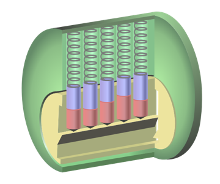
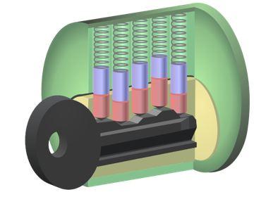
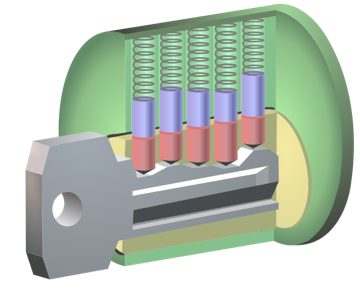
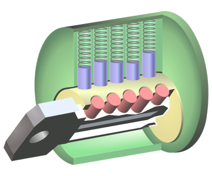
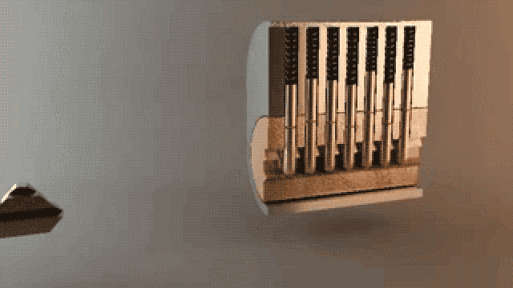
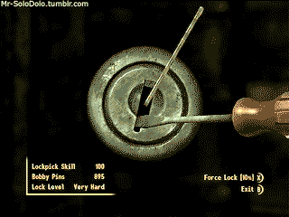
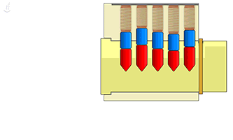
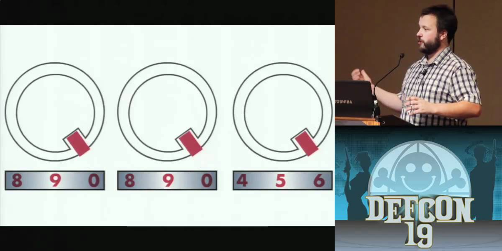
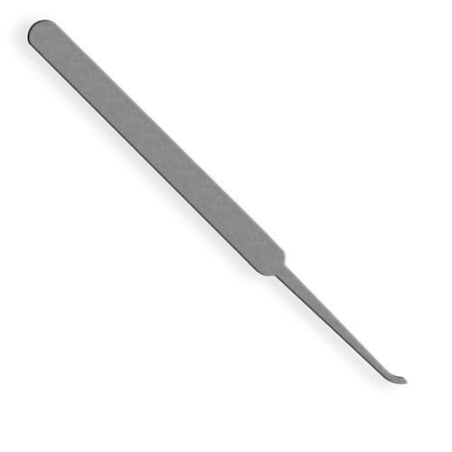
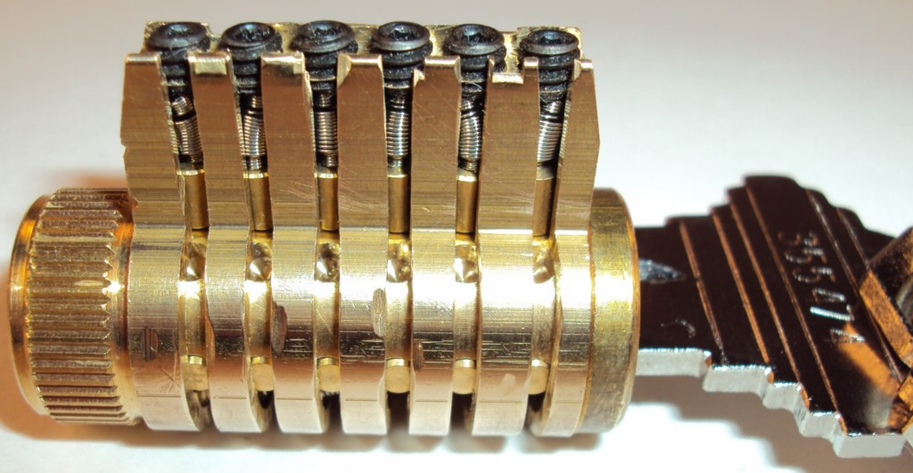

# Locks, and how to Pick 'em

### Without a key, the driver pins (blue) prevent the lock from opening. Also shown are key pins (red) and plug (yellow).

### The wrong key inserted causes the driver pins as well as some of the key pins to prevent the plug from turning.

 
### The correct key perfectly aligns the top of the key pins (red) with the edge of the plug (sheer point).

### The lock turns as they key pins are aligned with the edge of the plug.

### How a lock works with a normal key.

# Picking Locks

### Most lockpicking techniques rely on a tension wrench to provide pressure.

### No lock is perfect. The various pins have very slight diameter or placement anomalies.

### Thus, when you apply the tension, only one of the pin stacks (key and driver pin) will be blocking the rotation. This pin is known as the “bound pin”.

# Lockpicking Techniques
## Single-pin picking
### Single-pin picking is the most traditional lockpicking technique. The key (pun!) to single pin picking is using the pick to feel for the bound pin.

### As the driver of a bound pin clears the shear line, there will be an audible click. The pin is now considered to be “set” (goes from blue to grey in the above gif). 
### An easy way to tell if a pin is set is feeling the pressure - set pins don’t have pressure from the springs above them.

# Raking
### Raking is a quicker, less precise technique. By moving all of the pins rapidly, the hope is they will catch on the shear line. Can be more damaging to a lock, but may open cheaper locks easily.

# Appendix
## Security Pins
### More complex locks have additional challenges, such as security pins. These can be tricky to identify and trickier to bypass. We have a couple of these to try.

### Visible above, the shapes of these driver pins cause them to catch before the driver pin is clear of the plug. Below, the diagrams show how different security pins can cause difficulties by “catching” before they clear the shear line.

## Master keys
### Implementing master keys is interesting - each lock must open for two different keys, one of which is the same for all locks. The diagram below shows an example of a lock supporting a master key.

# Video Tutorials
### Schuyler Towne's video tutorial series is highly recommended for learning. Click the picture below to jump to his introduction to lockpicking basics.

### Schuyler also had a great talk at DEFCON 19 about lock security, linked below.

# Learning Materials
### As for the materials you'll need to practice, all you need to start is a tension wrench, hook pick, and half diamond pick (picks pictured below).

### A practice lock is also extremely helpful. Cutaway locks have a transparent side, allowing you to see the pins as you attempt to pick them.

#### These tools can all be found on Amazon or other online retailers for varying prices. If you'd like to try out or borrow some picks and practice locks before purchasing, talk to one of the Hacker Club coordinators. The club has tons of lockpicks and practice locks that we'd be more than willing to share.

